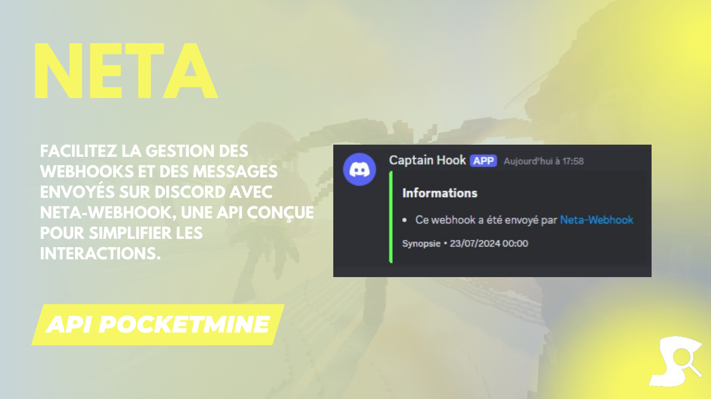

# Neta-Webhook API 📡

Facilitez la gestion des webhooks et des messages envoyés sur Discord avec Neta-Webhook, une API conçue pour simplifier les interactions.

## Idée d'utilisation
- Envoyer des messages sur Discord
- Loguer des informations
- Gérer des webhooks
- Créer des alertes
- Et bien plus encore...

## Installation
Pour installer [Neta-Webhook](https://github.com/Synopsie/Neta-Webhook) dans votre projet, si vous utilisez [composer](https://getcomposer.org/):
`````injectablephp
composer require synopsie/neta-webhook
`````

Si vous n'utilisez pas [composer](https://getcomposer.org/), alors je vous invite à mettre l'API entièrement dans votre projet, et a changer les namespaces.

## Utilisation

**Embed**
``````injectablephp
$embed = new \neta\class\Embed();
$embed->setTitle($string); #Permet de définir le titre de l'embed
$embed->setDescription($string); #Permet de définir la description de l'embed
$embed->addField($name, $value, $inline); #Permet d'ajouter un champ à l'embed
$embed->setAuthor($name, $icon, $url); #Permet de définir l'auteur de l'embed
$embed->setColor($color); #Permet de définir la couleur de l'embed
$embed->setFooter($text, $icon); #Permet de définir le footer de l'embed
$embed->setImage($url); #Permet de définir l'image de l'embed
$embed->setThumbnail($url); #Permet de définir la miniature de l'embed
``````
**Message**
````injectablephp
$message = new \neta\class\Message();
$message->setUsername($string); #Permet de définir le nom d'utilisateur du message
$message->setAvatar($url); #Permet de définir l'avatar du message
$message->setContent($string); #Permet de définir le contenu du message
$message->addEmbed($embed); #Permet de définir l'embed du message
$message->setTts($bool); #Permet de définir si le message doit être lu à haute voix
````

**Webhook**
``````injectablephp
$webhook = new \neta\Webhook($url, $message);
$webhook->submit() #Permet d'envoyer le message sur le webhook
``````

## Support

Besoin d'aide ou avez-vous des questions ? N'hésitez pas à nous contacter ou à consulter la documentation pour obtenir des informations supplémentaires.

## Crédits

[Neta-Webhook](https://github.com/Synopsie/Neta-Webhook) est développé par [Synopsie](https://discord.gg/JkpT7BJPXR). Merci à toute l'équipe pour son travail acharné et son dévouement à améliorer l'expérience de développement pour la communauté Discord.
Facilitez la gestion des webhooks et des messages sur Discord avec Neta-Webhook et simplifiez vos interactions en ligne ! 📡

